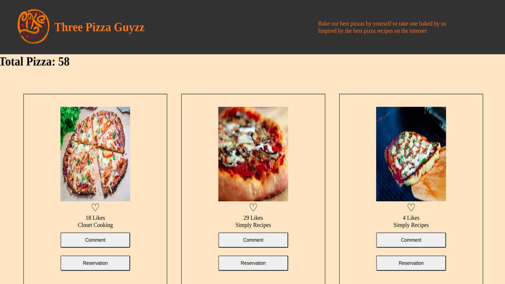

# Javascript-Capstone: Three Pizza Guyzz

> This website comprises a pizza restaurant menu of Three Pizza Guyzz Restaurant.

Inspired by the best pizza recipes from the internet and by not claiming the recipes as their one, they share them with the users, to give them the possibility to bake their pizza at home.
If internet users want to become customers, they can reserve a particular pizza for a few days, and the restaurant takes the responsibility that after the moment the customer arrives at the spot, the pizza will be ready in a maximum of 15 minutes.

## Built With

- Major languages: JavaScript, HTML & CSS;
- Frameworks: Vanilla JavaScript
- Technologies used: Webpack, Jest, GitFlow, GitHub, Terminal

## Live Demo

[Live Demo](https://three-pizza-guyzz.netlify.app/)

## Getting Started

To get a local copy up and running follow these simple example steps.

### Prerequisites

Install or update on your local terminal the node.js package.

### Setup

To get a local copy up and running follow these simple steps.

To setup the Three Pizza Guyzz project in your local, in the repo page:
click on code (dropdown list) > Download as ZIP;
or open terminal of path you want to install project and run this command  
`git clone git@github.com:nicupop729/JavaScript-Capstone.git`

### Install

Run in your terminal the following commands:

**`$ cd JavaScript-Capstone/`** 
**`$ npm install`** 
**`$ npm run build`** 
**`$ npm start`**

## Authors

👤 **Michael**

- GitHub: [@micheaol](https://github.com/micheaol)
- Twitter: [@micheaol](https://twitter.com/micheaol)
- LinkedIn: [LinkedIn](https://linkedin.com/in/micheaol)

👤 **Hope**

- GitHub: [@Hope1226](https://github.com/Hope1226)
- Twitter: [@twitterhandle](https://twitter.com/twitterhandle)
- LinkedIn: [LinkedIn](https://linkedin.com/in/linkedinhandle)

👤 **Nicu**

- GitHub: [@nicupop729](https://github.com/nicupop729)
- Twitter: [@nicupop729](https://twitter.com/nicupop729)
- LinkedIn: [LinkedIn](https://www.linkedin.com/in/nicolae-pop/)

## 🤝 Contributing

Contributions, issues, and feature requests are welcome!

Feel free to check the [issues page](https://github.com/nicupop729/JavaScript-Capstone/issues).

## Show your support

Give a ⭐️ if you like this project!

## Acknowledgments

This is a project done during Capstone for JavaScript Module at **[Microverse](https://www.microverse.org/)**, a remote web-developer school, using their support and frameworks provided. 
For this website, we used the [forkify API](https://forkify-api.herokuapp.com/v2), provided by **[Jonas Schmedtmann](https://codingheroes.io/)**

## 📝 License

This project is [MIT](./MIT.md) licensed.
